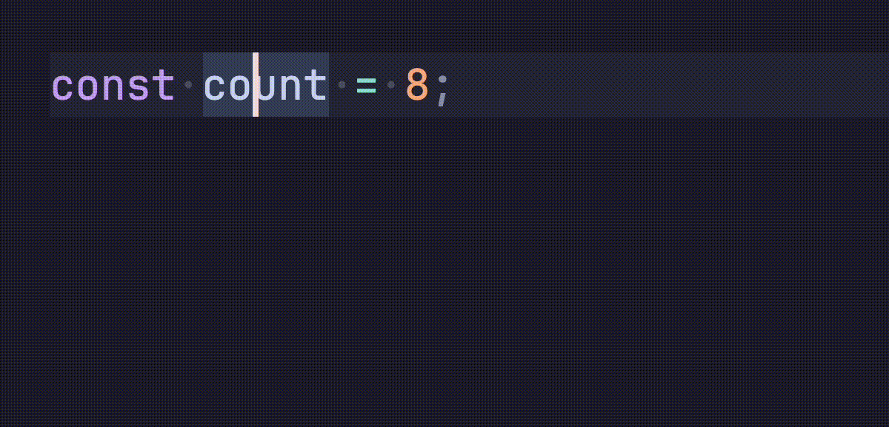

# 🐸 Simple Console Log

The simplest console log shortcut for your JavaScript/TypeScript.

## Usage

1. Place cursor on a variable.

2. Use the keyboard shortcut:
- Windows/Linux: `Ctrl` `Alt` `l` 
- Mac: `Ctrl` `Option` `l` 

=> 🪄 ✨ `console.log('🐸 count:', count);`

Works for any JavaScript, JSX, TypeScript, TSX file as well as Astro, Svelte, and Vue.

## Requirements

Simple Console Log only works with the following file types:
  - `.js`
  - `.jsx`
  - `.ts`
  - `.tsx`
  - `.mjs`
  - `.cjs`
  - `.mts`
  - `.cts`
  - `.astro`
  - `.svelte`
  - `.vue`

## Release Notes

### 1.0.0

Initial release of Simple Console Log

## FAQs

### Why is there a frog?

That's the Simple Console Log frog 🐸. 

